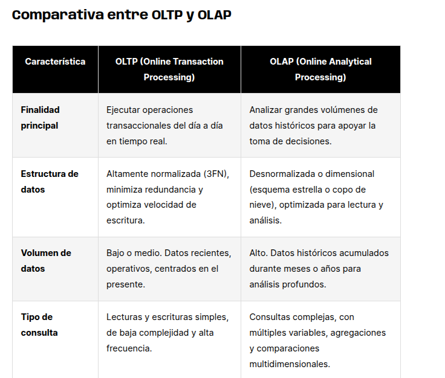
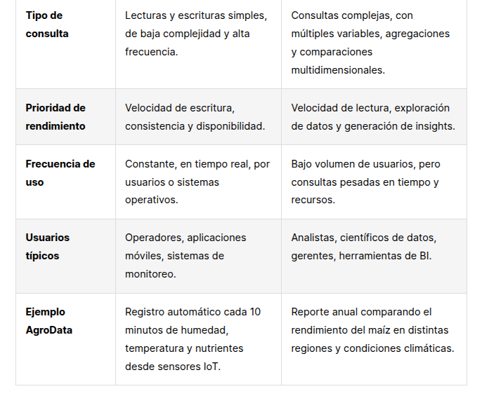
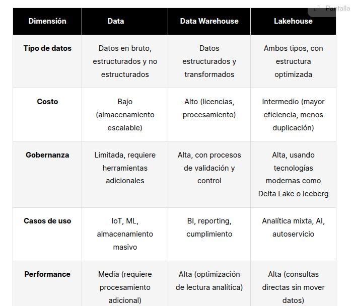

¿Qué es la arquitectura de datos?

La arquitectura de datos es el marco estructural que define cómo se recopilan, almacenan, transforman y consumen los datos

Función estratégica       | Ejemplo personal                                           | Aplicación en AgroData
--------------------------|------------------------------------------------------------|------------------------------------------------------------
Tomar decisiones informadas | Revisar tu historial de gastos para decidir si puedes viajar | Analizar si un cultivo necesita riego extra según humedad y temperatura recientes
Gobierno de datos         | Guardar documentos importantes etiquetados y en carpetas claras | Estandarizar mediciones de sensores y evitar datos inconsistentes o duplicados
Cumplimiento regulatorio  | Declarar impuestos con todos los soportes organizados      | Garantizar trazabilidad de los datos y cumplir con normas de calidad y privacidad
Eficiencia operativa      | Usar una app para registrar las compras y no repetir productos | Evitar reprocesos en informes o errores por medir dos veces el mismo sensor
Transformación digital    | Automatizar la iluminación de tu casa según hora o clima   | Integrar modelos predictivos que alertan condiciones de riesgo o recomiendan acciones

Componentes típicos de una arquitectura de datos moderna

Una arquitectura de datos moderna está compuesta por módulos interconectados que permiten mover los datos desde su origen hasta su uso estratégico

componente                  | Descripcion                                                               |Ejemplo                                                                          |
--------------------------  | ------------------------------------------------------------------------  | -------------------------------------------------------------------------------------------|
Origen de datos             | Puntos donde se generan los datos. Pueden ser internos o externos.        |
Ingesta                     | Procesos que capturan y trasladan los datos desde su origen.              |
Almacenamiento              | Lugares donde se conservan los datos según su tipo y uso.                 | (- Data Lake: archivos CSV en crudo.
                            |                                                                           |- Data Warehouse: métricas por cultivo.
                            |                                                                           |- Lakehouse: análisis híbrido de datos estructurados y no estructurados.)
Procesamiento               | Transformación y limpieza para que los datos sean útiles.                 |- ETL: extraer-limpiar-cargar datos desde sensores.
                                                                                                        |-  ELT: cargar datos en bruto y transformar dentro del almacén.
Consumo de datos            | Formas en que los usuarios y sistemas acceden a la información.           1 Dasboards, APis Algoritimos, reportes

Ventajas
Escalabilidad: Cada componente puede crecer de forma independiente.                                                 

Flexibilidad: Permite combinar distintos tipos de datos y tecnologías.

Trazabilidad: Facilita el seguimiento de origen y transformación de los datos.

Automatización: Reduce errores manuales y mejora la eficiencia operativa

Desventajas 
Complejidad: Requiere habilidades técnicas y coordinación de equipos

Costos iniciales: La inversión en infraestructura y herramientas puede llegar a ser alta.

Gobierno de datos exigentes: Sin buenas prácticas, pueden haber redundancia, inconsistencia o falta de calidad.

OLT vc OLPT

OLTP (Online Transaction Processing) se refiere a sistemas diseñados para ejecutar operaciones transaccionales en tiempo real, como:

Registro inmediato de eventos (ej. lectura de sensores)

Actualización y consulta de datos operativos

Alta concurrencia con consultas rápidas y simples

Cada variable de comparación resalta este contraste:
Finalidad y estructura: OLTP prioriza eficiencia operativa, OLAP facilita la exploración.

Tipo de consulta y volumen: OLTP maneja interacciones frecuentes pero simples, OLAP trabaja con pocas consultas pero muy complejas.

Usuarios y frecuencia: OLTP es usado por aplicaciones y sistemas; OLAP por humanos que analizan.

OLTP: Modelamiento Normalizado

El modelo OLTP se basa en normalización, una técnica que organiza los datos en múltiples tablas relacionadas, minimizando la redundancia y asegurando la integridad.

# Data Lakes vs Data Warehouses vs Lakehouse

