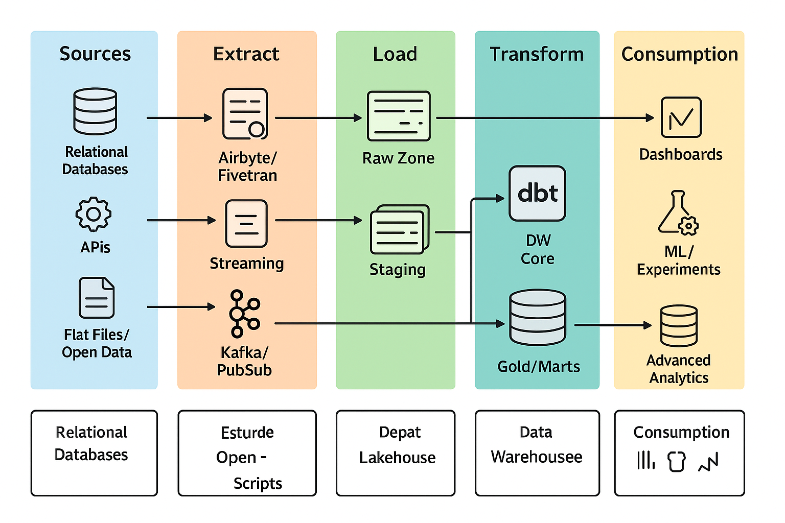

# **Entregable 1 - Documento Técnico**

## **Descripción General del Pipeline ELT**

### 1. **Objetivo del Pipeline**

El objetivo de este pipeline ELT (Extract, Load, Transform) es procesar grandes volúmenes de datos provenientes de diversas fuentes (datasets en CSV y en el futuro otras fuentes como APIs o bases de datos) para transformarlos en información útil que apoye las decisiones estratégicas de la empresa.

Este pipeline busca responder preguntas de negocio clave, tales como:

* ¿Cuál es el precio promedio de los alojamientos por barrio y distrito?
* ¿Qué tipo de habitación es el más ofrecido y cuál genera mayor revenue estimado?
* ¿Cuáles son los anfitriones con más propiedades listadas y cómo varían sus precios?
* ¿Existen diferencias significativas en la disponibilidad anual entre barrios o tipos de alojamiento?
* ¿Cómo evoluciona el número de reseñas por mes en los diferentes distritos de la ciudad?
* ¿Qué barrios tienen la mayor concentración de alojamientos activos?
* ¿Cómo se distribuyen los precios y qué outliers existen?
* ¿Qué relación existe entre la disponibilidad anual y la cantidad de reseñas como proxy de ocupación?

El pipeline extraerá datos de diversas fuentes (por ejemplo, propiedades, precios, tipos de habitaciones, anfitriones) y los cargará en un Data Warehouse escalable para facilitar su análisis posterior.

---

## 2. **Descripción de las Etapas ELT**

El pipeline estará basado en las siguientes etapas: **Extract**, **Load**, y **Transform**.

### **Extract (Extracción)**

* **Fuentes de Datos:**

  * El dataset inicial es un archivo CSV con información de propiedades, precios, tipos de habitaciones y detalles de anfitriones. Además, se incorporarán otras fuentes de datos como APIs externas para obtener tasas de cambio del dólar y datos adicionales sobre clientes o métricas de interacción con la plataforma.

* **Proceso de Extracción:**

  * La extracción se realizará de forma automatizada y periódica. Los archivos CSV se descargarán y transferirán al Data Warehouse mediante un proceso programado. Las APIs se consultarán de forma automática, especialmente para obtener las tasas de cambio diarias.

### **Load (Carga)**

* **Data Warehouse:**

  * Los datos extraídos serán cargados directamente en un Data Warehouse escalable. Para ello, se propone como solución **Google Storage**.

* **Estructura del Data Warehouse:**

  * **Raw Layer (Capa Cruda):** Los datos se cargarán en su formato original, sin modificaciones, permitiendo una versión sin procesar de los mismos.
  * **Staging Layer (Capa de Preparación):** En esta capa, se realizarán validaciones iniciales y se organizarán los datos en un formato más adecuado para su análisis.
  * **Core Layer (Capa Central):** Se realizarán transformaciones adicionales para limpiar y enriquecer los datos, como la unificación de campos o la creación de métricas clave.
  * **Gold Layer (Capa Final):** Esta capa contendrá los datos listos para el análisis y será utilizada por las herramientas de Business Intelligence (BI) para la creación de reportes y dashboards.

### **Transform (Transformación)**

* **Transformaciones a Nivel de Pipeline:**

  * Las transformaciones necesarias para responder las preguntas de negocio se realizarán en esta etapa. Algunas de las transformaciones específicas incluyen:

    * **Cálculo del precio promedio de los alojamientos por barrio y distrito.**
    * **Identificación del tipo de habitación más ofrecido y el que genera mayor revenue estimado.**
    * **Análisis de los anfitriones con más propiedades y su variación de precios.**
    * **Análisis de la disponibilidad anual por barrio y tipo de alojamiento.**
    * **Cálculo de la evolución mensual de reseñas por distrito.**
    * **Distribución de precios y detección de outliers.**
    * **Relación entre la disponibilidad anual y la cantidad de reseñas.**

  * **Tasas de Cambio del Dólar:** Las tasas de cambio se integrarán diariamente a través de una API externa, asegurando que los precios se conviertan a la moneda base (por ejemplo, pesos) para facilitar el análisis.

---

## 3. **Contexto General del Proyecto y Necesidades que Aborda**

### **Contexto:**

La empresa necesita una infraestructura de datos que permita integrar y analizar grandes volúmenes de información de manera eficiente. Actualmente, las fuentes principales son registros de propiedades (con detalles sobre precios, tipos de habitaciones, y anfitriones), así como transacciones comerciales.

### **Necesidades que Aborda:**

* **Integración de múltiples fuentes de datos:** Centralización de los datos provenientes de diversas fuentes para su análisis conjunto.
* **Escalabilidad:** A medida que la empresa crece y los volúmenes de datos aumentan, el pipeline debe ser capaz de manejar estos volúmenes sin perder rendimiento.
* **Calidad de datos:** Asegurar que los datos estén limpios, consistentes y actualizados, especialmente en lo relacionado con las tasas de cambio.
* **Toma de decisiones estratégicas basadas en datos:** El pipeline debe proporcionar métricas y KPIs clave que apoyen la toma de decisiones, como:

  * Precio promedio de los alojamientos por barrio y distrito.
  * Tipo de habitación más ofertado y de mayor revenue.
  * Anfitriones con más propiedades y análisis de sus precios.
  * Análisis de disponibilidad anual y ocupación.
  * Identificación de outliers en precios.

---

## 4. **Diagrama de Arquitectura**

### **Flujo de Datos:**

1. **Extracción:**

   * Se extraen los datos de propiedades (CSV) y las tasas de cambio (API) de manera automatizada.
2. **Carga:**

   * Los datos extraídos se cargan en el Data Warehouse en la capa **Raw**, sin transformaciones iniciales.
3. **Transformación:**

   * En la capa **Staging**, se realizan las primeras transformaciones, como la validación de datos y la conversión de monedas.
   * En la capa **Core**, se calculan métricas claves como el precio promedio por barrio y distrito, el revenue estimado por tipo de habitación, y otros KPIs.
   * En la capa **Gold**, los datos transformados y optimizados están listos para el análisis.

---

## 5. **Evaluación de Fuentes de Datos y Respuesta a las Preguntas de Negocio**

Las siguientes fuentes de datos permitirán responder las preguntas de negocio planteadas:

### **1. Precio Promedio por Barrio y Distrito:**

La información del archivo CSV contiene precios y ubicaciones precisas, lo que permite calcular el precio promedio por barrio y distrito.

### **2. Tipo de Habitación Más Ofrecido y Mayor Revenue:**

El archivo CSV incluye detalles sobre los tipos de habitación y precios, permitiendo identificar el tipo de habitación más común y el que genera mayor revenue estimado.

### **3. Anfitriones con Más Propiedades y Variación de Precios:**

El archivo CSV permite identificar a los anfitriones con más propiedades listadas y analizar cómo varían los precios de sus propiedades.

### **4. Disponibilidad Anual por Barrio y Tipo de Alojamiento:**

Se puede utilizar la columna **availability\_365** del archivo CSV para analizar la disponibilidad de alojamientos a lo largo del año, desglosado por barrio y tipo de alojamiento.

### **5. Evolución Mensual de Reseñas:**

Se puede analizar la evolución de las reseñas mensuales por distrito utilizando las fechas de reseñas presentes en el archivo CSV, lo que permitirá detectar patrones de crecimiento o declive en la actividad de los anfitriones.

### **6. Concentración de Alojamientos Activos por Barrio:**

El archivo CSV también permite identificar en qué barrios se encuentran la mayor cantidad de alojamientos activos, lo que puede indicar zonas de alta demanda o saturación.

### **7. Distribución de Precios y Outliers:**

A través de los precios de los alojamientos, podemos realizar un análisis de distribución de precios para identificar outliers o precios atípicos en diferentes barrios o tipos de alojamiento.

### **8. Relación entre Disponibilidad Anual y Cantidad de Reseñas:**

Al analizar la columna **availability\_365** y la cantidad de reseñas, podemos establecer una relación que actúe como proxy de la ocupación de los alojamientos.

---

## 6. **Stack Tecnológico y Justificación**

El stack tecnológico para este pipeline incluye herramientas y servicios que garantizan la eficiencia, escalabilidad y automatización necesarias para procesar grandes volúmenes de datos y responder a las preguntas de negocio planteadas:

* **Apache Airflow**: Para la orquestación del pipeline, programando y gestionando las tareas de extracción, carga y transformación.
* **DBT (Data Build Tool)**: Para las transformaciones de los datos, realizando limpieza, agregación y cálculos necesarios.
* **Google BigQuery / PostgreSQL**: Como Data Warehouse escalable para almacenar y procesar los datos.
* **Docker y Docker Compose**: Para contenerizar los servicios del pipeline y garantizar la portabilidad y consistencia del entorno de desarrollo y producción.
* **API de tipo de cambio (Fixer.io o Open Exchange Rates)**: Para la conversión diaria de precios de USD a la moneda local.

---

### **Diagrama**

Este diagrama cubre el flujo de datos desde la **extracción** hasta la **disponibilidad final** en el Data Warehouse, proporcionando las bases para un pipeline ELT escalable y eficiente.

---
### **Conclusión:**

Este pipeline ELT está diseñado para procesar, transformar y analizar grandes volúmenes de datos, proporcionando respuestas precisas a las necesidades actuales de negocio y futuras mediate escalado.

